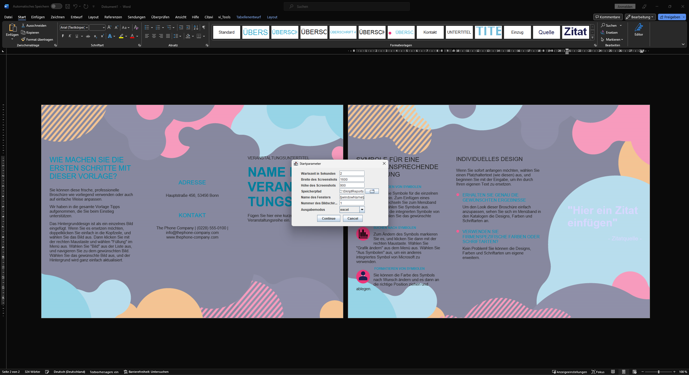
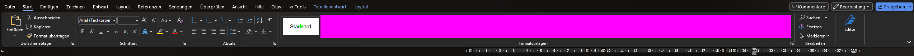

# mateo-Screenshot Tool

Mit dem mateo-Screenshot Tool lassen sich bequem Kommandos für den AutoHotkey Treiber für Windows erstellen. 
Dazu kann über das Werkzeug ein Screenshot aufgenommen werden. Anschließend kann über einen einfachen Click bestimmt werden, an welche Stelle der Aufnahme später im Skript geklickt werden soll. Darüber hinaus können Bereiche festgelegt werden, die bei der Erkennung ignoriert werden sollen.

Das Programm unterscheidet zwischen dem "Zuschneiden"- (engl. "crop") und "Anmerken"- (engl. "annotate") Modus. Es startet immer im Zuschneiden-Modus und wechselt, nach der Auswahl eines Bereichs, auf den das Bildschirmfoto zugeschnitten werden soll, in den Anmerken-Modus. 

## Startoptionen

Die Parameter werden der Reihe nach aufgelöst, daher ist die Reihenfolge wichtig. Entweder müssen alle Parameter angegeben werden oder keiner. Die angabe einzelner ausgewählter Parameter ist nicht möglich.

* 1: Wartezeit in Sekunden vor der Aufnahme eines neuen Screenshots (bspw. `2`)

* 2: Breite des skalierten Screenshots (bspw. `1600`)

	Hinweis: Sollte in der Regel etwas kleiner sein als die derzeitige horizontale Auflösung des Bildschirms (in der Regel 1920 Pixel) 

* 3: Höhe des skalierten Screenshots (bspw. `900`)

	Hinweis: Dürfte in der Regel das 0,5625-fache der Breite (Parameter 2) sein, wenn es sich um einen 16:9-Bildschirm handelt. Das heißt in der  

* 4: Speicherpfad für die erzeugten Screenshots (bspw. `"C:\Pfad mit Leerzeichen\"`)

* 5: Name des Fensters, in dem später gesucht werden soll (bspw. `"§windowName§"` um Flexibilität für mateo zu erhalten – so kann der Fenstername dann im Verlauf des mateo- bzw. Excel-Skripts einfach mit `setStorageValue(TARGET_STORAGE_KEY = "windowName", VALUE = "Erwarteter Fenstername")` gesetzt werden)

* 6: Nummer des Bildschirms, der verwendet werden soll, sowohl für die Anzeige des Tools, als auch für die Screenshots die aufgenommen werden sollen (bspw. `1`)

	Hinweis: Null-indiziert; d. h. der "erste" Bildschirm trägt die Ziffer 0! Welcher Bildschirm der "erste", "zweite" etc. ist, ist nicht per se zu sagen oder stabil. Am einfachsten herauszufinden über Ausprobieren

* 7: Ausgabemodus. Muss genau sein `Excel` oder `mateoScript` sein (Groß-/Kleinschreibung ist aber egal).

	* Modus `Excel`: Gibt das generierte Klick-Kommando im Excel-Format (separiert mit Tabulatoren) aus. Das Kommando beginnt immer mit der Ziffer "0", womit es in einer leeren Zeile in Spalte "D" der Excel-Mappe eingefügt werden kann.

	* Modus `mateoScript`: Gibt das generierte Klick-Kommando im mateoScript-Format aus

Beim Ausführen von dem Tool werden die eigegebenen Parameter in einer Maske dargestell. Falls keine Parameter eingeben wurden, werden default-Werte verwendet.

### Beispielhafter voller Aufruf

`java -cp Screenshot-Tool-<Version>-SNAPSHOT.jar ScreenshotApp 1 1600 900 "C:\Pfad mit Leerzeichen\" "§windowName§" 1 mateoScript`

## Bedienung

Die Bedienung ändert sich in Abhängigkeit des derzeit aktiven Modus. Es gibt allerdings auch Dinge, die in beiden Modi gleich funktionieren.

Alle u. g. Beschreibungen für Tasten erfordern, dass das Fenster des Tools aktiv ist.

### Allgemein (unabhängig vom Modus)

* Mit der Taste `N` wird nach dem eingestellten Timeout (s. Parameter 1 oben) einer neuer Screenshot erzeugt. Das Hauptfenster verschwindet dabei, wenn man `N` drückt, um den Wechsel zur/die Anzeige der Applikation, von der ein Screenshot erzeugt werden soll, zu vereinfachen.

* Mit `ESC` kann das Programm beendet werden. Vor dem Beenden des Programms wird nach einer Bestätigung gefragt.

### Zuschneiden-Modus

* Mit gedrückter linker Maustaste ziehen, um einen Ausschnitt auszuwählen. Es wird dann in den Anmerken-Modus gewechselt.

### Anmerken-Modus

* Mit gedrückter linker Maustaste können Zonen eingezeichnet werden, die bei der Erkennung ignoriert werden sollen. Wie eine solche Zone (Bereich in der Farbe Fuchsia gefärbt) aussehen kann ist nachfolgend dargestellt:
  

	* Mit der Taste `U` kann das zuletzt eingezeichnete Rechteck wieder entfernt werden

* Ein einfacher Klick in das Bild öffnet den Speichern-Dialog für exakt den Punkt, auf den geklickt wurde.
	* Es wird eine zusätzliche Datei erzeugt, in der der angeklickte Punkt mit einem grünen Kreuz angezeigt wird
  
	* Außerdem erzeugt ein Klick in das Bild den nötigen mateoScript-Befehl, um den gemachten Klick "nachzuahmen". Dieser wird sowohl auf der Kommandozeile ausgegeben, als auch direkt in die Zwischenablage kopiert.
  Der Befehl könnte dabei wie folgt aussehen:
  
  `clickImageWin(WINDOW_NAME = "§windowName§", IMAGE_RELATIVE_PATH = "1692628116287.png", BASEDIR = "C:\SkriptReports", RELATIVE_X = "-660", RELATIVE_Y = "-8")`